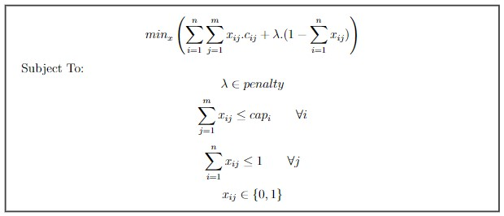
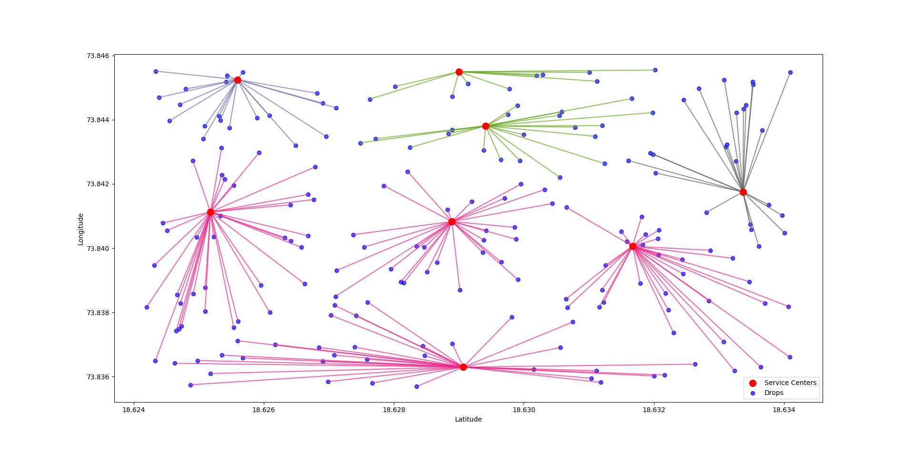
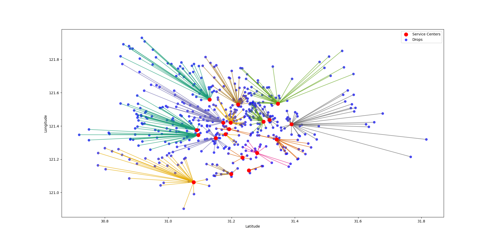
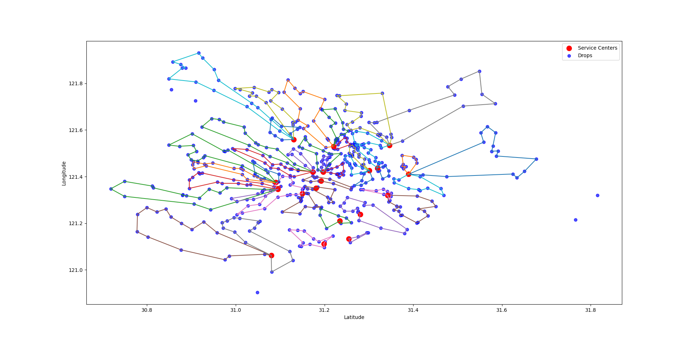

<div align="center">
  <h1>Geo Intelligence</h1>
</div>
<br>

<p align="center">
            
</p>


<div align="center">
    <h1>Team: Disruptors</H1>
    <H3>Xpressathon 2022 : Challenge 2 </h3>
    <h3> Theme: Geo Intelligence</h3>
    <h3> Team Members: <strong>Sushil Adwe | Chirag Hegde | Ayush Yadav</strong></h3>
    <h3> Indian Institute of Technology, Guwahati </h3>
</div>
<br/>


<!-- ABOUT THE PROJECT -->

## **Problem Statement**
Provide a cost effective solution to allocate shipments to their nearest service centres. Each service centre has a defined delivery capacity.Lesser the distance of delivery location from service centre, more the cost effectiveness.
Eg:

10,000 shipments to be delivered to end customers by 5 service centres in a city. 3 Service centres have a delivery capacity of 2000 shipments per day and 2 service centres have delivery capacity of 3000 shipments per day.


<b>Factors to consider:</b>

◉ Shipments have different dimensions and volumetric weight. <br/>
◉ Shipment delivery location can be equidistant from 2 service centers.<br/>
◉ Service centers use two wheelers for deliveries.<br/>


<br>
<br>

## **Our Solution** [Google Collab](https://colab.research.google.com/drive/1nRZFkXU0_5Wf5acADHmyhZf8YMUVB9rv)
Last mile delivery refers to the last leg of supply chain operations. A product's journey from a warehouse to the doorstep of the end-customer. This last step of the delivery process is most critical and should be optimized for a better user experience and dramatic reduction in operating costs.<br/>
We are proposing a <b>Mixed Integer Programming (MIP)</b> model for allocating shipments to the nearest service centers while keeping in mind the capacity constraints.</br> 
Further we formulate a <b>Greedy heuristic</b> and compare the performance of both the solutions.
</br>
</br>
<b>MIP model :</b>
</br></br>
Let number of warehouses be <b>n</b> and the number of shipments be <b>m</b></br>
<b>cij</b> be the cost of delivering a shipment from the <b>ith</b> Warehouse to the <b>jth</b> Shipment
location</br></br>

<br/>
<br/>
<b>Heuristic Greedy model :</b>
</br></br>
◉ Initially assign each shipment to its nearest service center irrespective of the capacity
of the service center.</br>
◉ Repeat the following steps until the number of shipments allocated to each service
center is less than it’s capacity.</br>
Traverse over each service center and for each service center that has been over-loaded:
<ul>
 <li>Find the number of overloaded shipments = n.</li>
 <li>For each shipment assigned to this service center, we find the least possible
   additional cost that will be incurred </br>
   if this shipment is allocated to another service center.</li>
 <li>We transfer n shipments with the least transfer costs to their next nearest
   neighbour service center.</li>
</ul>          

</br></br>


<!-- USAGE EXAMPLES -->
## **Screenshots**
<div align="center" ><br/>
Allocation for Low density of Shipments<hr width=600/>
  <br/><br/>
Allocation for High density of Shipments<hr width=600/>
  <br/><br/>
Final Routes returned by the algorithm<hr width=600/>
  <br/><br/>
</div>
<br/>

### **Tech Stack used**

* [OR-Tools](https://developers.google.com/optimization)
* [CBC solver Backend](https://projects.coin-or.org/Cbc)
* [Python](https://www.python.org/)
* [Mathplotlib](https://matplotlib.org/)
* [Scipy](https://scipy.org/)
* [Numpy](https://numpy.org/)
* [Geopy](https://geopy.readthedocs.io/en/stable/)


<br/>

## **Installation**

_Below are the steps to clone the repository and  setting up the app in local._

### Prerequisites
* Python must be installed on your computer<br>


1. Clone the Repository
   ```sh
   git clone https://github.com/soul0101/Multi-Depot-Package-Allocation.git
   ```

2. Install Python packages that are used 
   ```sh
   pip install -r requirements.txt
   ```
   
3. Run main.py file
   ```sh
   python main.py
   ```


<p align="right"><br/></p>


<p align="right"><a href="#top"></a></p>
